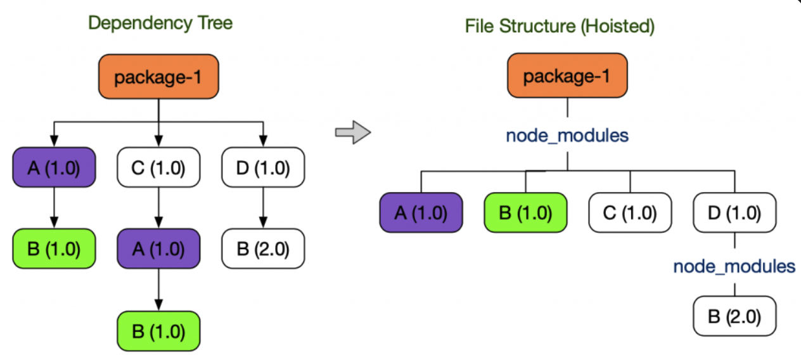
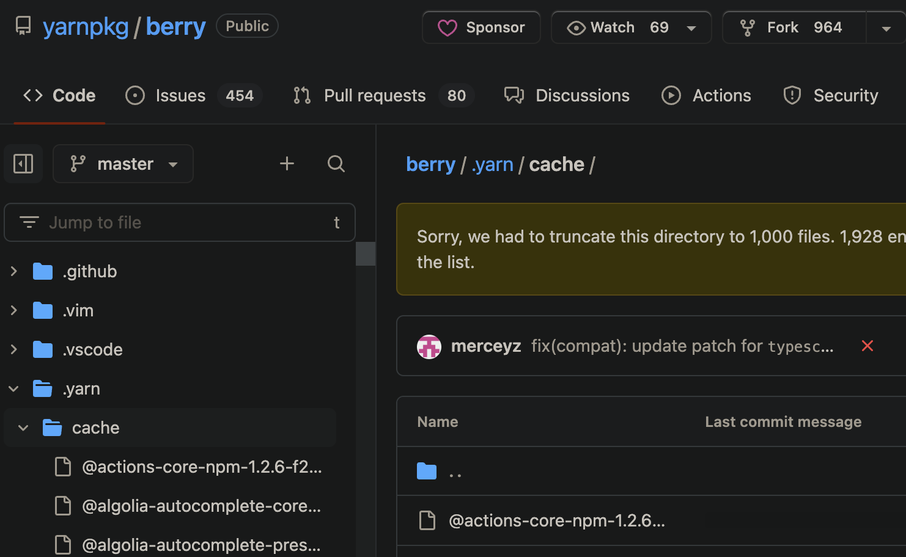
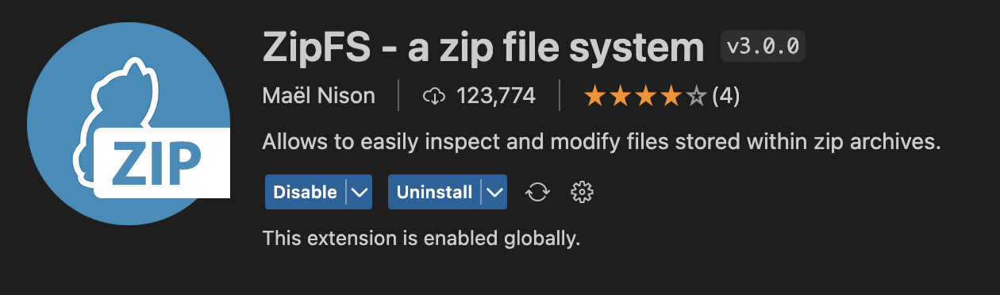

## Yarn Berry?
yarn V2의 명칭이며 현재 V1은 1.22.19를 마지막으로 관리가 중단된 상태이다.
berry는 npm의 각종 문제점을 개선해준다. [토스 기술 블로그](https://toss.tech/article/node-modules-and-yarn-berry)에 굉장히 잘 정리되어 있는데, 본 글은 링크의 글을 보고 알게 된 것을 정리한 글이다.

## NPM의 문제점
1. 비효율적인 의존성 검색
- 파일 시스템을 이용하여 의존성을 관리하는데, 패키지를 찾기 위해 계속 상위 디렉토리의 node_modules 디렉토리를 탐색한다. 따라서 패키지를 늦게 찾을 수록 readdir, stat과 같은 느린 I/O 호출이 반복되고 심지어 경우에 따라서는 실패하기도 한다.

2. 환경에 따라 달라지는 동작 
- 1에서 언급한 대로 NPM은 상위 디렉토리의 node_modules를 찾을 때 까지 검색한다. 이 특성 때문에 어떤 의존성을 찾게 될지는 해당 패키지의 상위 디렉토리 환경에 따라 달라지기 때문에 의존성을 불러오지 못하거나 다른 버전을 불러오게 될 수 있다.

3. 비효율적인 설치
- node_modules 디렉토리 구조는 매우 큰 공간을 차지한다. 또한 많은 I/O 호출이 필요해 진다. 이런 깊은 트리 구조에서 잘 설치됐는지 검증하려면 많은 수의 I/O 호출이 필요하기 때문에, Yarn v1과 NPM은 각 패키지의 내용이 올바른지 까지는 확인하지 않는다.

4. 유령 의존성
- Yarn v1과 NPM은 중복 설치되는 패키지를 줄이기 위해 호이스팅 기법을 사용한다. 여기까지만 들었을때는 그냥 좋다고 생각할 수도 있겠지만

- 상기 이미지 처럼 원래 package-1에서 가져올 수 없어야 하는 **B(1.0)**도 가져올 수 있게 되버렸다. 만약 누가 실수로라도 **B(1.0)**을 사용을 했고, 누군가가 B(1.0)패키지를 포함하는 패키지가 더 이상 사용되지 않는다고 생각해서 제거했다면 소리없이 같이 사라져 버릴 것이다.


## Plug'n'Play(PnP)
- 위의 문제들을 해결하기 위해 Yarn Berry는 PnP 전략을 이용하여 해결한다.
node_module를 생성하지 않고, ```.yarn/cache``` 디렉토리에 의존성의 정보를 zip파일로 저장하고, ```.pnp.cjs```파일에 의존성을 찾을 수 있는 정보가 기록된다.
이로 인해 문제가 되던 디스크 I/O 없이 어떤 패키지가 어떤 라이브러리에 의존하고 위치하는지를 바로 알 수 있게 되었다.

## PnP적용으로 얻는 이점
1. 향상된 의존성 검색 시간
- ```.pnp.cjs```파일을 통해 디스크 I/O 없이 어떤 패키지가 어떤 라이브러리에 의존하고 위치하는지를 바로 알 수 있게 되었기 때문에 빠르다
2. 재현성
- ```.pnp.cjs```로 관리되기 때문에 더 이상 외부 환경에 영향받지 않는다. 이로 인해 require() 또는 import문의 동작이 동일할 것임을 보장할 수 있게 되었다.
3. zero-install로 인한 설치시간 단축
- 깊은 node_modules 디렉토리를 생성하지 않아도 된다. 또한 .yarn/cache에 zip파일로 있는 압축파일을 repo에 올려 같이 관리를 하면 추가 없이 바로 실행이 가능하다. 기존 node_modules와 같이 많은 파일과 용량이 컸다면 사용할 수 없었겠지만 PnP전략으로 인해 zero-install이 가능해 졌다. 기존 방식으로는 브랜치를 바꾸고 의존성 설치를 다시하고...이런 작업이 필요가 없다.

*yarn berry또한 .yarn/cache 디렉토리를 같이 repo에 올려 관리하고 있다.*

4. 엄격한 의존성 관리
- node_modules와 같은 호이스팅을 하지 않아 유령 의존성이 일어나지 않는다.
5. 의존성 검증
- node_modules 방식에서는 올바르게 의존성이 설치되지 못해 귀찮게 node_modules 디렉토리 전체를 지우고 다시 설치하는 경우가 발생하곤 했다. 하지만 이제 ```.yarn/cache에서```zip으로 관리하면서 빠진 의존성을 찾거나 변경된 부분을 찾기가 쉬워졌다.


## PnP 적용법(TS + VSCode)
1. VSCode 익스텐션 ZipFs 설치(VSCode가 zip의존성을 읽을 수 있게 해준다)


2. yarn set version berry
3. 1로 인해 생성된 ```.yarnrc.yml```파일에 다음 내용을 추가한다.```nodeLinker: "pnp"```
4. yarn
5. yarn dlx @yarnpkg/sdks vscode
- IDE에서 TS + PnP를 사용하기위해 필요하다.
- [공식문서 참고](https://yarnpkg.com/getting-started/editor-sdks)
6. yarn plugin import typescript
- 자체적으로 타입을 포함하지 않는 패키지를 추가할 때 @types/패키지를 자동으로 추가해주는 편리한 플러그인이다.
7. ```cmd```+```shift```+```p``` -> Typescript: Select Typescript Version... -> Use Workspace Version 선택

## 만약 lint-staged를 사용할경우 필요한 작업
그냥 npx mrm lint-staged로 하면 꽤 간편하게 설정이 됐었지만 아무래도 berry에선 안되는 모양이므로 다음과 같은 방식으로 해결하였다.
1. yarn add -D husky
2. yarn husky install
3. yarn add -D lint-staged
4. .husky에 pre-commit파일 생성
5. yarn husky add .husky/pre-commit
6. pre-commit파일을 열어 다음과 같은 내용을 추가
```sh
#!/usr/bin/env sh
. "$(dirname -- "$0")/_/husky.sh"

yarn lint-staged
```

## 실제로 사용해본 결과
기존에 tRPC 사용해볼 용도의 간단한 내용의 모노레포 프로젝트가 있었는데 tRPC 버전을 올릴겸 yarn berry를 적용해 보았더니 다음과 같이 개선 되었다. 

```308MB, 파일 22373개``` → ```146MB, 파일776개```

용량도 용량이지만 파일 개수가 어마어마하게 줄었다. 가벼운 프로젝트에서도 이 정도의 개선이 이루어질 정도라면 IDE의 파일 인덱싱 부담이 상당히 줄어드는 부수효과도 얻을 수 있을 것으로 보인다.

주의할 점으로는 패키지가 PnP를 지원하지 않는다거나, 버전을 올려야 하는 경우이다. 버전업의 경우 메이저 버전이 바뀌어야 한다면 꽤 큰 공사가 될 수도 있으니 마냥 좋다고 바꾸기는 어려워 보인다.
