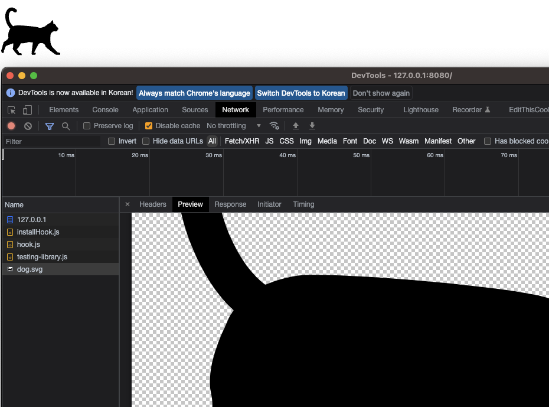

## 서비스워커 등록 코드 및 동작 확인 위한 img태그 삽입 코드
```js
navigator.serviceWorker
    .register("/sw.js")
    .then((reg) => console.log("서비스워커 등록됨", reg))
    .catch((err) => console.log("서비스워커 등록실패", err));

  // 이미지 캐싱 확인을 위한 코드
  setTimeout(() => {
    const img = new Image();
    img.src = "/dog.svg";
    img.style="width: 100px; height: 100px;";
    document.body.appendChild(img);
  }, 1000);

  // 요청을 가로채고 응답하는 것을 보기 위한 fetch
  fetch("http://localhost:3000/api")
    .then((res) => res.json())
    .then((data) => console.log(data));
```

## 서비스워커 코드
```js
const image = "/cat.svg";

self.addEventListener("install", (event) => {
  console.log("V1 installing…");

  // cat.svg를 캐싱
  event.waitUntil(
    caches.open("static-v1").then((cache) => cache.add(image))
  );
});

self.addEventListener("activate", (event) => {
  console.log("V1 now ready to handle fetches!");
});

self.addEventListener("fetch", (event) => {
  const url = new URL(event.request.url);

  // 같은 origin이고 dog.svg를 요청했다면 캐시에 있는 이미지(cat.svg)를 넘겨준다
  if (url.origin == location.origin && url.pathname == "/dog.svg") {
    event.respondWith(caches.match(image));
  }

  // 현재 서버에 저런 경로가 없던간에 CORS문제가 있는 경로던 간에 서비스워커가 가로채면 상관없다
  if (url.pathname === '/api') {
    event.respondWith(new Response(JSON.stringify({ data: 'CORS가 났더라도 가로채기 때문에 상관없음' })));
  }
});
```
## 처음으로 서비스 워커가 있는 페이지에 들어와 설치 및 활성화 된 모습


## 새로고침 하여 dog.svg에 대한 요청을 가로채 캐시에 있던 cat.svg를 받은 모습


## fetch 프록시 확인

