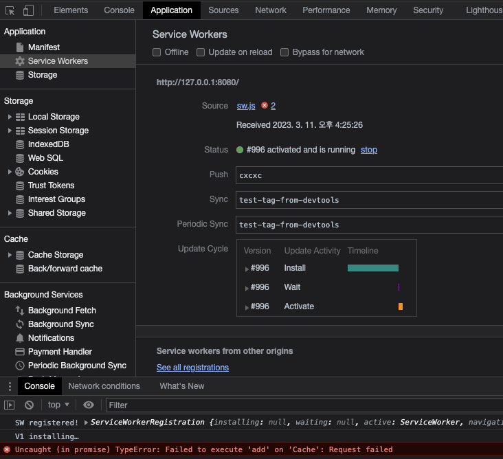
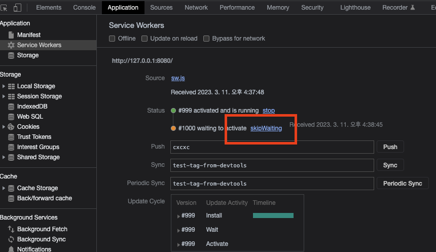

## 서비스 워커?
최근 테스트를 작성하면서 MSW(Mock Service Worker)를 이용하고 있는데, MSW가 서비스 워커를 이용하여 작성된 라이브러리이기 때문에 관심이 생겨서 알아보게 되었다.

MDN의 서비스 워커 설명을 빌리자면 이렇다.
> 서비스 워커는 웹 응용 프로그램, 브라우저, 그리고 (사용 가능한 경우) 네트워크 사이의 프록시 서버 역할을 합니다. 서비스 워커의 개발 의도는 여러가지가 있지만, 그 중에서도 효과적인 오프라인 경험을 생성하고, 네트워크 요청을 가로채서 네트워크 사용 가능 여부에 따라 적절한 행동을 취하고, 서버의 자산을 업데이트할 수 있습니다. 또한 푸시 알림과 백그라운드 동기화 API로의 접근도 제공합니다.

중요한 포인트는 다음과 같다고 생각한다.
1. 백그라운드에서 실행됨
2. 프록시 서버 역할을 한다

백그라운드에서 실행에 대한 부분만 부가 설명을 하자면
 - 메인 JS와는 다른 스레드에서 동작하므로 서비스 워커의 작업이 메인 스레드의 JS 작업을 방해하지 않는다(논 블로킹). 하지만 DOM과 Web Storage에 접근 할 수는 없다.

## 서비스 워커의 생명주기
서비스 워커를 작성할 때 필수적으로 알아야 하는 부분이라고 할 수 있다. 생명주기는 다음과 같다.

#### 1. 서비스 워커가 제어하는 사이트에 처음 접근하는 순간 다운로드
#### 2. 서비스 워커 설치
#### 3. 서비스 워커 활성화

기억해 둘 것은 처음 들어와서 활성화가 됐다고 하더라도 이미 브라우저가 응답을 받은 상태이기 때문에 서비스 워커에 작성한 동작은 다시 방문해야 확인이 가능할 것이다.

## 서비스 워커의 업데이트 특징
### 1. 기존 서비스 워커 파일과의 **바이트 단위 비교**로 구분하여 업데이트 한다. 
이게 뭐가 좋냐하면...그동안 실무를 하면서 js,css파일에 대한 수정사항을 즉각 반영하려 이전 캐싱을 무효화 하기 위해 다음과 같이 사용하는 경우를 자주 볼 수 있었다.

```<script src="/js/some.js?ver=1.0.0"></script>```

더 최악은 아예 querystring에 timestamp를 넣어서 아예 캐싱을 막아버리는 경우도 자주 보았다.

하지만 서비스 워커는 이전 파일에서 변경점이 있는지 알아서 구분해주기 때문에 이런 귀찮은 작업을 할 필요가 없는것이다.

### 2. 업데이트할 서비스 워커파일에 에러가 나면 업데이트 하지 않는다
- 에러가 났다면 chrome 개발자 도구 기준으로 Application-Service Workers에서 확인 가능하다.


### 3. 설치된 새 서비스 워커의 활성화 조건
1. 이전 서비스 워커가 제어하는 클라이언트(탭)이 없을 때 활성화 된다. 즉 모든 탭을 닫고 다시 들어가야 한다.
2. 탭이 하나만 있고, 해당 페이지를 새로고침한다고 활성화 되지 않는다.
    - self.skipWating을 통해 활성화를 빠르게 할 수 있지만 좋은 생각은 아니다. 아직 이전 서비스 워커가 작업중인 무언가가 있는데 강제로 활성화 한다면? 굉장히 찾기 힘든 버그를 유발할 수도 있다. 
    - 물론 개발자가 동작을 확인 할 때는 이런 부분이 오히려 불편한 부분이기 때문에 그럴 땐 개발자 도구에서 skipWating을 클릭하여 강제로 활성화 해주면 된다.



다음은 실제로 코드를 작성하여 짧게 사용해보려 한다 [서비스워커 사용해보기](/서비스워커-사용해보기).
