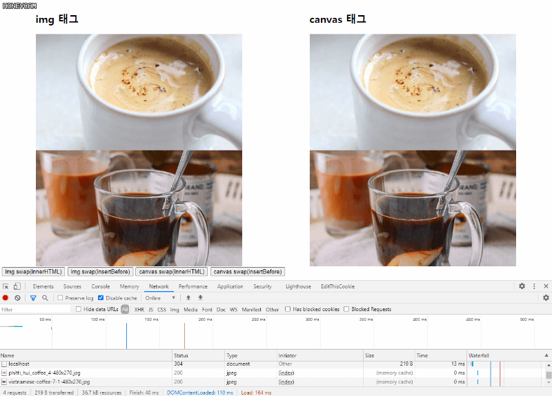
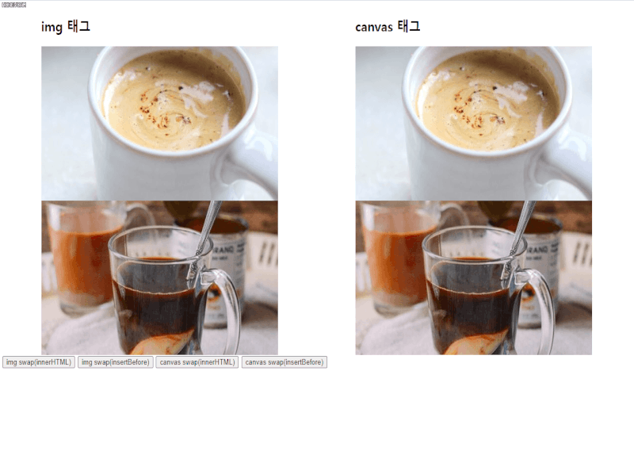

이미 시간이 꽤 지났지만 바닐라JS로 토이프로젝트를 하던 도중 경험한 일이다.

## 특정 요소 두 개를 swap하고 싶은데...
토이프로젝트를 하던 도중 canvas가 담긴 요소끼리 swap 해야 할 일이 생겼고, 어떻게 할까? 생각하던 도중 바로 들었던 생각은
> 아! 그냥 innerHTML이용해서 바꾸면 쉽겠네!
같은 생각을 하였다. 그래서 처음 엔 다음과 같은 코드를 작성 하였다.
```js
function swap(nodeA, nodeB) {
  [nodeA.innerHTML, nodeB.innerHTML] = [nodeB.innerHTML, nodeA.innerHTML];
}
```
하지만 이 방법은 전혀 먹히질 않았고 조사해보다 원인을 알게 되었다. 모던 JavaScript 튜토리얼 사이트(https://ko.javascript.info/basic-dom-node-properties#ref-2284)의 내용을 인용하여 이유를 말하자면 이렇다.
> **기존 내용을 '완전히 삭제’한 후 밑바닥부터 다시 쓰기 때문에 이미지나 리소스 전부가 다시 불러와 집니다.**

이를 확인하기 위해 간단한 스크립트를 작성해 보았다

## 이미지가 담긴 요소의 swap
사실, 단순히 img태그에서 이미지를 불러오게 하는 방식으로는 크게 차이가 없어보였다. 이는 알아서 이미지가 캐싱되었기 때문으로, 크롬 개발자 도구에서 캐싱을 잠시 끄고 테스트 해보았다.



처음 2번의 swap은 insertBefore를 이용한 swap이고, 그 다음은 innerHTML을 통한 swap이다. 개발자도구나 화면을 보면 알 수 있듯이 innerHTML로 swap 했을 경우 캐싱을 안했다면 이미지를 다시 불러오는 것을 확인 할 수 있다.

## canvas가 담긴 요소의 swap
이번에는 문제가 더욱 심각하다.



마찬가지로 처음 2번의 swap은 insertBefore를 이용한 swap이고, 그 다음은 innerHTML을 통한 swap이다.
화면을 보면 알 수 있듯이 innerHTML로 swap을 했더니 canvas로 그린 내용이 사라져 버린다! 위에서 언급했던대로 기존 내용을 '완전히 삭제'한 후 밑바닥부터 다시 쓰기 때문에 이런 현상이 발생한 것이다.


## 결론 
innerHTML을 통해 바로 swap 하는건 편해보이지만 이러한 이유 및 XSS 취약한 등의 이유로 피하는 편이 좋다. 비록 지금은 웹페이지는 React로만 작성하고 있지만 기본을 아는것이 중요하다고 생각하기에 다시 정리해보았다.