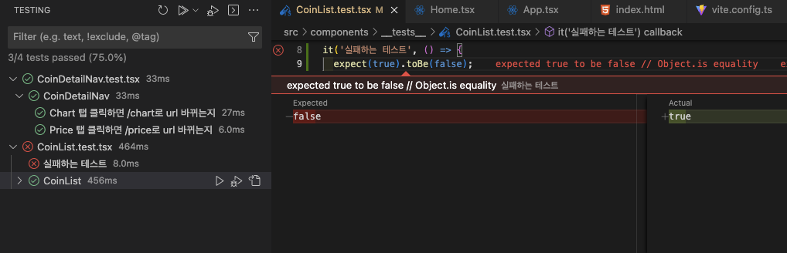

## Vitest?
공식 사이트의 말을 빌리자면...
> Vite-native unit test framework

## 짧게 써보고 느낀점
### 1. 설정이 편하다
-  Vite-native라는 말을 쓴 것 답게 vite config파일 안에 설정한 alias도 그대로 사용 가능했다.(내 기억이 맞다면 jest의 경우는 따로 또 지정해야 해서 다소 귀찮았다.)
- vite config 파일이 공유되는걸 제외 하더라도, 설정이 jest보다 할게 적고 편하게 느껴졌다.
### 2. 빠르다
- 정확한 벤치마킹을 해보진 않았지만 watch모드의 경우 체감이 될 정도로 jest보다 빨랐다.

## 사용한 설정 파일(vite.config.ts)
```js
/// <reference types="vitest" />
import { defineConfig } from 'vite';
import react from '@vitejs/plugin-react';

// https://vitejs.dev/config/
export default defineConfig({
  test: {
    globals: true,
    environment: 'jsdom',
    setupFiles: './setupTests.ts',
    include: ['**/__tests__/*.{ts,tsx}'],
  },
  plugins: [react()],
  resolve: {
    alias: {
      '@': '/src',
    },
  },
});
```
위의 설정 파일에서 test property가 vitest에 대해 설정한 전부다. 

## VSC 익스텐션을 사용한 모습


## 결론
react 프로젝트를 시작할 때 vite를 애용하고 있는데, 앞으로는 vitest도 같이 애용하게 될 것 같다. 또한 공식 사이트의 말을 다시 한 번 더 빌리자면
> Vitest aims to position itself as the Test Runner of choice for Vite projects, and as a solid alternative even for projects not using Vite.

즉, vite를 사용하지 않는 프로젝트에서도 대안으로 자리잡는 것을 목표로 하고 있다고 한다. 사용해보니 제법 맘에 들었기 때문에 다음엔 Next.js에서도 vitest를 사용하는 쪽으로 가보려고 한다.
